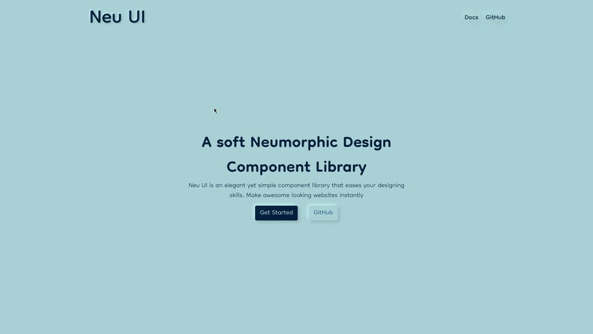
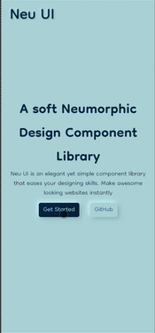

<h1 align="center">
<br />
<a href="https://neu-ui-cl.netlify.app/"></a>

<br/>
</h1>

# Neu UI

<h3> Neu UI is an elegant yet simple component library that eases your designing skills. Make awesome looking websites instantly. 
</h3>
<br/>
<!-- PROJECT SHIELDS -->
<p align="center">
  <!-- <a href="https://github.com/Husain01/Neu-UI/blob/main/LICENSE" target="blank">
  
  </a> -->
  <a href="https://github.com/Husain01/Neu-UI/fork" target="blank">
  
  </a>
  <a href="https://github.com/Husain01/Neu-UI/stargazers" target="blank">
  
  </a>
  <a href="https://github.com/Husain01/Neu-UI/issues" target="blank">
  
  </a>
  <a href="https://github.com/Husain01/Neu-UI/pulls" target="blank">
  
  </a>
  <a href="https://github.com/Husain01/Neu-UI/network" target="blank">
  
  </a>
</p>

# **⚙ Installation**

To use this library, link the stylesheet below in your html file.

```bash
  <link rel="stylesheet" href="https://neu-ui-cl.netlify.app/css/components.css"> 
```

for more info click <a href="https://neu-ui-cl.netlify.app/style%20guide/introduction/introduction.html">here</a>

# **🎯 Utility Classes**

- [Colors](https://neu-ui-cl.netlify.app/style%20guide/colors/colors.html)
- [Typography](https://neu-ui-cl.netlify.app/style%20guide/typography/typography.html)
<br />

# **🧩 Components**

- [Alerts](https://neu-ui-cl.netlify.app/components/alert/alert.html)
- [Avatar](https://neu-ui-cl.netlify.app/components/avatar/avatar.html)
- [Badge](https://neu-ui-cl.netlify.app/components/badge/badge.html)
- [Button](https://neu-ui-cl.netlify.app/components/button/button.html)
- [Card](https://neu-ui-cl.netlify.app/components/card/card.html)
- [Image](https://neu-ui-cl.netlify.app/components/image/image.html)
- [Input](https://neu-ui-cl.netlify.app/components/input/input.html)
- [Navbar](https://neu-ui-cl.netlify.app/components/navbar/navbar.html)
- [Rating](https://neu-ui-cl.netlify.app/components/ratings/ratings.html)
- [Toast](https://neu-ui-cl.netlify.app/components/toast/toast.html)
<br />

# Desktop Version

# Mobile Version

# Issue Reporting

Encountered a bug or do you need a need a feature request ? Please to do check the issues tab on the repo if your issue / request does not exist , [open a new issue](https://github.com/Husain01/Neu-UI/issues/new)

**_If you have encountered a bug a before and after picture of the bug would be very helpful or if time permits a small video of the bug would greatly help us undertand the issue._**


# 🔗 Links
[](https://husainbhagat.netlify.app/)
[](https://www.linkedin.com/in/hussain-bhagat/)
[](https://twitter.com/itswhoissane)
